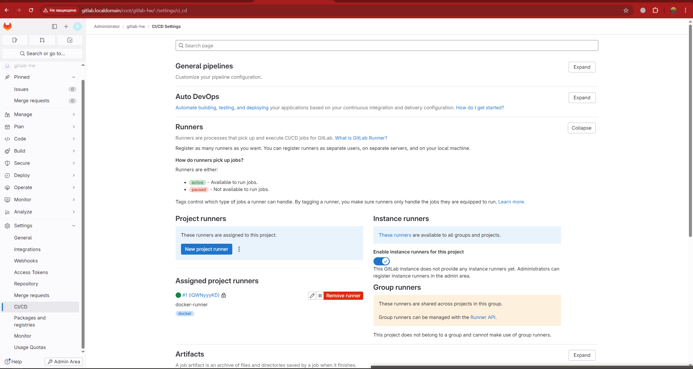
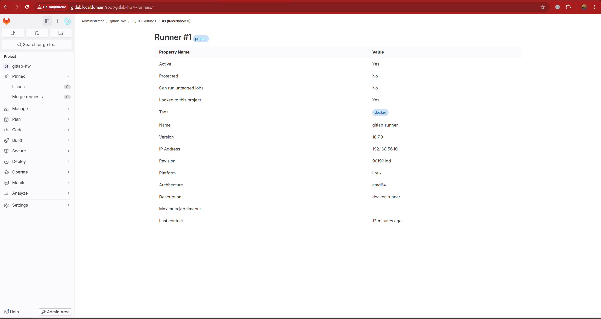
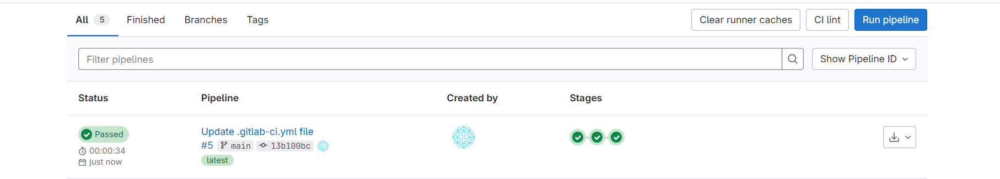
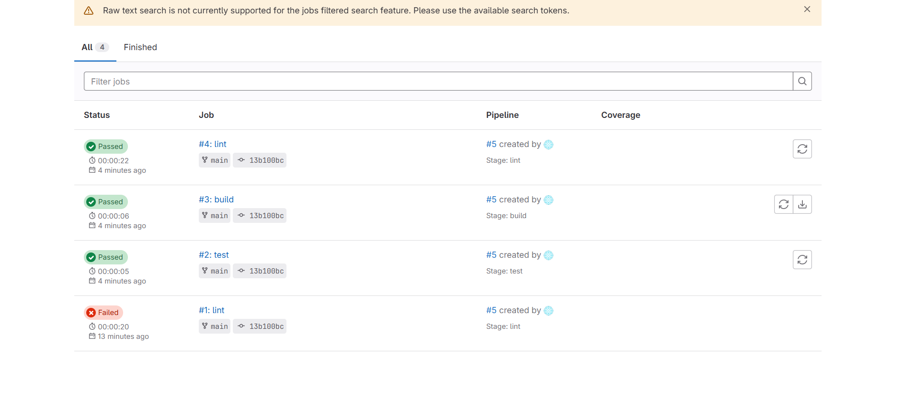

# Домашнее задание к занятию "Gitlab" - `Зиновьев Михаил.`

Задание 2
Что нужно сделать:

Запушьте репозиторий на GitLab, изменив origin. Это изучалось на занятии по Git.
Создайте .gitlab-ci.yml, описав в нём все необходимые, на ваш взгляд, этапы.
В качестве ответа в шаблон с решением добавьте:

файл gitlab-ci.yml для своего проекта или вставьте код в соответствующее поле в шаблоне;
скриншоты с успешно собранными сборками.

### Задание 1
Что нужно сделать:

Разверните GitLab локально, используя Vagrantfile и инструкцию, описанные в этом репозитории.
Создайте новый проект и пустой репозиторий в нём.
Зарегистрируйте gitlab-runner для этого проекта и запустите его в режиме Docker. Раннер можно регистрировать и запускать на той же виртуальной машине, на которой запущен GitLab.
В качестве ответа в репозиторий шаблона с решением добавьте скриншоты с настройками раннера в проекте.

Основные шаги выполнения задания:

Задание 1. Развёртывание GitLab и GitLab Runner

Что было сделано:

Локально развернут GitLab с использованием Vagrant и VirtualBox по инструкции из репозитория курса.

GitLab стал доступен по адресу http://gitlab.localdomain.

В веб-интерфейсе GitLab создан новый пустой проект.

На той же виртуальной машине установлен и зарегистрирован GitLab Runner.

Runner настроен с использованием Docker executor.

Runner успешно отображается в разделе Settings → CI/CD → Runners и имеет статус active.

Результат:
GitLab работает, проект создан, GitLab Runner корректно подключён и готов выполнять CI/CD задания.

---

### Задание 2

Что нужно сделать:

Запушьте репозиторий на GitLab, изменив origin. Это изучалось на занятии по Git.
Создайте .gitlab-ci.yml, описав в нём все необходимые, на ваш взгляд, этапы.
В качестве ответа в шаблон с решением добавьте:

файл gitlab-ci.yml для своего проекта или вставьте код в соответствующее поле в шаблоне;
скриншоты с успешно собранными сборками.

Задание 2. Настройка CI/CD Pipeline

Что было сделано:

Существующий репозиторий был запушен в GitLab с изменением origin.

В корне репозитория создан файл .gitlab-ci.yml.

В файле описан CI/CD pipeline из трёх стадий:

lint — проверка наличия конфигурационного файла;

test — тестовый запуск окружения;

build — сборка артефакта проекта.

Pipeline успешно выполняется с использованием настроенного GitLab Runner.

Все стадии pipeline завершаются со статусом Passed, артефакт сборки формируется.

Результат:
CI/CD pipeline успешно настроен и выполняется, что подтверждается зелёным статусом сборки в GitLab.

---

`
